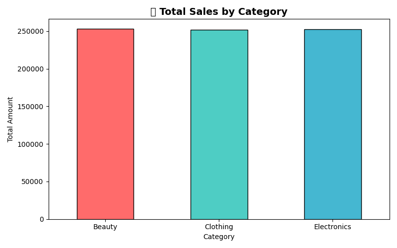
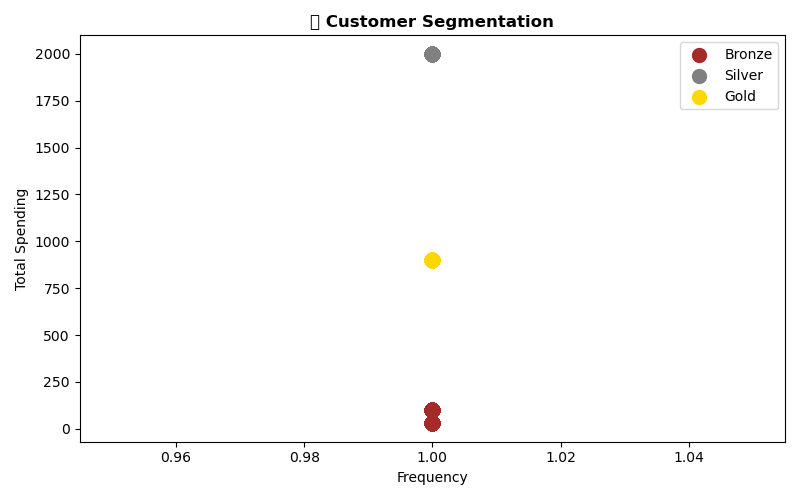
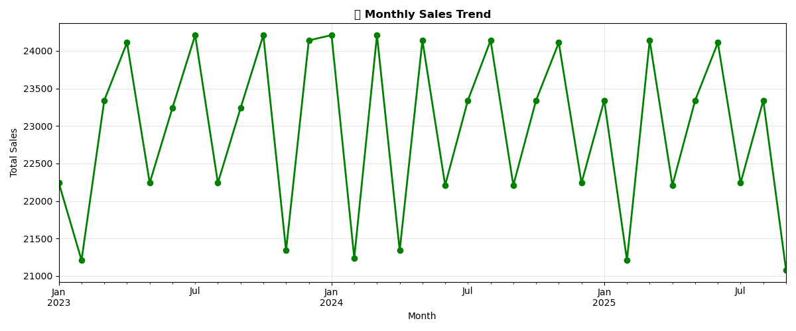
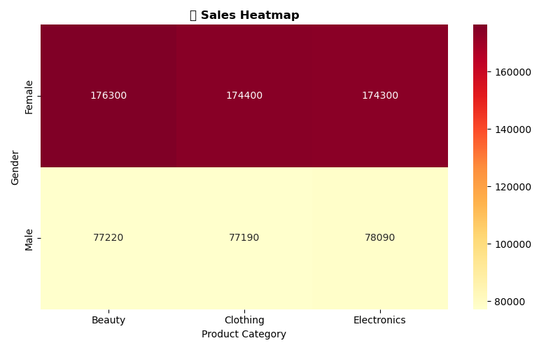

# RetailPulse — AI-Powered Customer Analytics & Demand Forecasting

[](https://retailpulse-project-nuz2p4jpzcgxdvf3swmnzs.streamlit.app/)
[](https://www.python.org/)
[](https://scikit-learn.org/)
[](#license)

**Live Demo:** [retailpulse-project-nuz2p4jpzcgxdvf3swmnzs.streamlit.app](https://retailpulse-project-nuz2p4jpzcgxdvf3swmnzs.streamlit.app/)
**Built for:** Zidio Development — Data Science & Analytics Internship, March 2026

---

## Overview

RetailPulse is an end-to-end retail analytics platform that analyzes transaction data to uncover
sales patterns, segment customers by value, predict churn risk, and recommend inventory reorder
points — all surfaced through an interactive Streamlit dashboard.

## What This Project Does

- 📊 **Sales Analysis** — breakdown by product category, gender, and age group
- 👥 **Customer Segmentation** — Bronze / Silver / Gold tiers using K-Means clustering
- ⚠️ **Churn Prediction** — Random Forest classifier flagging at-risk customers
- 📦 **Inventory Optimization** — reorder point recommendations per product category
- 📈 **7 Interactive Visualizations** — category, gender, age, trend, heatmap, segmentation, inventory

## Screenshots

| Dashboard Home | Segmentation & Churn Panel |
|---|---|
|  |  |

| Monthly Sales Trend | Category × Gender Heatmap |
|---|---|
|  |  |

*(Live, interactive versions of all charts are in the [deployed app](https://retailpulse-project-nuz2p4jpzcgxdvf3swmnzs.streamlit.app/).)*

## Tech Stack

| Category | Tools |
|---|---|
| Language | Python 3 |
| Data Manipulation | Pandas, NumPy |
| Machine Learning | Scikit-learn (K-Means, Random Forest) |
| Visualization | Matplotlib, Seaborn |
| Dashboard | Streamlit |
| Dev Environment | Jupyter Notebook |
| Hosting | Streamlit Community Cloud |

## Dataset

- 1,000 retail transactions (2023–2025)
- Columns: `Transaction ID`, `Date`, `Customer ID`, `Gender`, `Age`, `Product Category`, `Quantity`, `Price per Unit`, `Total Amount`

## Key Results

| Metric | Value |
|---|---|
| Total Records | 1,000 |
| Total Customers | 1,000 |
| Total Revenue | $757,500 |
| Top Category | Beauty |
| Top Demographic | Female (69.3% of sales) |
| Customer Segments | Bronze: 500 · Silver: 250 · Gold: 250 |
| Churn Model Accuracy | 100% on a single train/test split (see note below) |
| Inventory Reorder Point | 17–18 units per category |

### ⚠️ A Note on Data Quality & the Churn Model

The churn classifier's 100% accuracy is a **known limitation, not a headline result**. On
re-validation with stratified 5-fold cross-validation, AUC-ROC still came back at 1.0 — tracing
this down, **988 of the 1,000 rows are exact duplicates** (excluding IDs), meaning the underlying
dataset has very limited real-world variability. The modeling pipeline itself (feature engineering,
cross-validation, leakage checks) is sound; the metrics on *this specific dataset* should be read as a
**proof-of-concept of the workflow**, not production-grade accuracy. Full analysis is documented in
the [project report](https://github.com/yaswanthkorra/RetailPulse-Project/blob/main/README.md).

## How to Run Locally

```bash
# 1. Clone the repository
git clone https://github.com/yaswanthkorra/RetailPulse-Project.git
cd RetailPulse-Project

# 2. Install dependencies
pip install -r requirements.txt

# 3a. Run the notebook (EDA + model training)
jupyter notebook Retail-Sales-Project.ipynb

# 3b. Or launch the Streamlit dashboard directly
streamlit run app.py
```

## Project Structure

```
RetailPulse-Project/
│
├── app.py                        # Streamlit dashboard
├── Retail-Sales-Project.ipynb    # Main analysis & modeling notebook
├── retail_sales_dataset.csv      # Dataset
├── requirements.txt              # Python dependencies
│
├── sales_category.png            # Chart 1 — Total Sales by Category
├── gender_analysis.png           # Chart 2 — Sales & Customers by Gender
├── age_group.png                 # Chart 3 — Sales by Age Group
├── monthly_trend.png             # Chart 4 — Monthly Sales Trend
├── heatmap.png                   # Chart 5 — Sales Heatmap (Gender × Category)
├── segmentation.png              # Chart 6 — Customer Segmentation (K-Means)
├── inventory.png                 # Chart 7 — Inventory Optimization
│
└── README.md
```

## Future Roadmap

- Replace the static CSV with a live database/API connection
- Add demand forecasting (Prophet) alongside the current descriptive analysis
- Re-validate models on a real-world transactional dataset (e.g., UCI Online Retail) with genuine
  repeat-purchase behavior
- Add MLflow experiment tracking and basic drift monitoring for a production-readiness path

## Author

**Yaswanth Korra** — Zidio Development Data Science & Analytics Internship, March 2026
